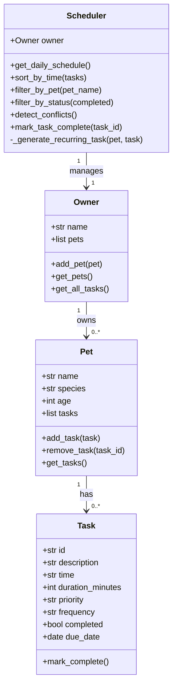

# PawPal+ (Module 2 Project)

You are building **PawPal+**, a Streamlit app that helps a pet owner plan care tasks for their pet.

## Scenario

A busy pet owner needs help staying consistent with pet care. They want an assistant that can:

- Track pet care tasks (walks, feeding, meds, enrichment, grooming, etc.)
- Consider constraints (time available, priority, owner preferences)
- Produce a daily plan and explain why it chose that plan

## Features

- **Add owners and multiple pets** via the sidebar
- **Schedule tasks** with time, duration, priority, and frequency
- **Sorted daily schedule** — all tasks displayed in chronological order
- **Filter tasks** by pet name or completion status
- **Conflict warnings** — tasks at the same time are flagged automatically
- **Recurring task automation** — daily/weekly tasks regenerate the next occurrence when marked complete
- **Live metrics** — total, completed, and pending task counts

## Smarter Scheduling

| Feature | How it works |
|---|---|
| **Sort by time** | `Scheduler.sort_by_time()` uses `sorted()` with a `lambda` key on the `HH:MM` time string — O(n log n), no external library needed. |
| **Filter by pet / status** | `filter_by_pet()` and `filter_by_status()` do a single-pass list comprehension over all `(pet_name, Task)` tuples. |
| **Conflict detection** | `detect_conflicts()` does one pass with a dictionary keyed on task time — O(n) — and returns conflict pairs with descriptive warnings rather than raising exceptions. |
| **Recurring tasks** | `mark_task_complete()` inspects the `frequency` field; for `"daily"` or `"weekly"` tasks it calls `_generate_recurring_task()`, which uses `timedelta` to compute the next due date and adds a fresh `Task` to the pet. |

## System Architecture



## Getting started

### Setup

```bash
python -m venv .venv
source .venv/bin/activate  # Windows: .venv\Scripts\activate
pip install -r requirements.txt
```

### Run the app

```bash
streamlit run app.py
```

### Run the CLI demo

```bash
python main.py
```

## Testing PawPal+

```bash
python -m pytest
```

The test suite (`tests/test_pawpal.py`) covers:

- **Task completion** — `mark_complete()` flips `completed` to `True`
- **Task addition** — `add_task()` increases pet task count
- **Task removal** — `remove_task()` finds by ID and shrinks list
- **Sorting correctness** — tasks added out of order come back chronologically
- **Filter by pet** — returns only that pet's tasks (case-insensitive)
- **Filter by status** — separates pending vs. completed tasks
- **Conflict detection** — flags exact time matches; passes when times differ
- **Daily recurrence** — completing a daily task creates a new task due tomorrow
- **Weekly recurrence** — completing a weekly task creates a new task due in 7 days
- **No recurrence for "once"** — one-off tasks do not spawn a successor
- **Edge cases** — unknown task IDs, empty pets, empty owners

**Confidence level: ★★★★☆** (4/5) — all core behaviours and key edge cases are verified.

## 📸 Demo

*(Add a screenshot of the running Streamlit app here)*

## Suggested workflow

1. Read the scenario carefully and identify requirements and edge cases.
2. Draft a UML diagram (classes, attributes, methods, relationships).
3. Convert UML into Python class stubs (no logic yet).
4. Implement scheduling logic in small increments.
5. Add tests to verify key behaviors.
6. Connect your logic to the Streamlit UI in `app.py`.
7. Refine UML so it matches what you actually built.
