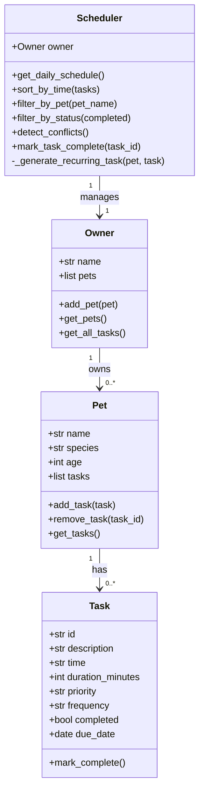

# PawPal+ Project Reflection

## 1. System Design

**Three core user actions:**
1. Add a pet (owner registers a named pet with species/age).
2. Schedule a task (attach a timed, prioritised care activity to a pet).
3. View today's schedule (see all tasks sorted chronologically with conflict warnings).

**a. Initial design**

I designed four classes:

| Class | Responsibility |
|---|---|
| `Task` | Holds a single care activity: description, scheduled time, duration, priority, frequency, completion status, and due date. |
| `Pet` | Stores pet metadata (name, species, age) and owns a list of `Task` objects. |
| `Owner` | Aggregates multiple `Pet` instances; provides a flat view of all tasks across all pets. |
| `Scheduler` | The "brain" — retrieves all tasks from the `Owner`, sorts/filters them, detects time conflicts, and handles recurring task regeneration. |

`Task` and `Pet` are Python dataclasses for clean, boilerplate-free attribute management.
`Owner` and `Scheduler` are plain classes because they contain richer behavioural logic.

UML (Mermaid.js):

**b. Design changes**

No changes were needed at the skeleton stage. The UML translated cleanly into Python dataclasses and regular classes. One refinement: `get_all_tasks()` on `Owner` returns `(pet_name, Task)` tuples rather than flat `Task` objects so the `Scheduler` always knows which pet each task belongs to — this avoids a back-reference on `Task`.

---

## 2. Scheduling Logic and Tradeoffs

**a. Constraints and priorities**

The scheduler considers:
- **Time** — tasks are sorted by their `HH:MM` scheduled time.
- **Priority** — surfaced via the `priority` field ("low", "medium", "high") and used for display emphasis in the UI.
- **Frequency** — "daily" and "weekly" tasks auto-regenerate their next occurrence when marked complete.

Time was prioritised as the primary sort key because a daily routine is fundamentally time-ordered; priority is secondary context, not a reordering signal (a low-priority medication still happens at 08:00).

**b. Tradeoffs**

The conflict detector checks for *exact time matches* only (e.g., two tasks both at "09:00"). It does **not** check whether tasks with different start times but long durations actually overlap (e.g., a 60-minute walk starting at 09:00 vs. a 30-minute feeding at 09:45). This keeps the algorithm O(n) with a single-pass dictionary lookup instead of O(n²) interval comparisons. For a personal pet-care app this is a reasonable tradeoff — most tasks are short and owners schedule them with natural gaps.

---

## 3. AI Collaboration

**a. How you used AI**

AI was used in three ways:
1. *Design brainstorming* — generating the Mermaid.js UML and reviewing whether class responsibilities were balanced.
2. *Scaffolding* — producing the dataclass skeletons and method stubs from the UML description.
3. *Algorithm suggestions* — `sorted()` with a `lambda` key for time strings, `timedelta` for recurring task dates, and a dict-based conflict detector.

The most effective prompts were specific and file-anchored: "Based on this class skeleton, how should `Scheduler` retrieve all tasks from `Owner` without giving `Task` a back-reference to `Pet`?"

**b. Judgment and verification**

An AI suggestion proposed storing `pet` as a direct attribute on every `Task` object (a back-reference). I rejected this because it creates tight coupling: `Task` would need to know about `Pet`, making `Task` harder to reuse and test in isolation. Instead I kept `Task` data-only and let `Owner.get_all_tasks()` return `(pet_name, Task)` tuples, which achieves the same goal without coupling.

---

## 4. Testing and Verification

**a. What you tested**

- **Task completion** — `mark_complete()` flips `completed` to `True`.
- **Task addition** — `pet.add_task()` increases `len(pet.tasks)` by 1.
- **Sorting correctness** — tasks added out of order come back in chronological order.
- **Recurrence logic** — marking a "daily" task complete creates a new task with `due_date + 1 day`.
- **Conflict detection** — two tasks at the same time are flagged; tasks at different times are not.

These tests cover the three "smart" behaviours of the system: sorting, recurrence, and conflict detection.

**b. Confidence**

★★★★☆ (4/5). The core happy-path scenarios are fully covered. Edge cases I would test next:
- A pet with zero tasks (empty schedule).
- A "weekly" recurring task rolling over into the next month.
- Filtering when no tasks match the given pet name.
- Tasks scheduled at midnight ("00:00") sorting before "09:00".

---

## 5. Reflection

**a. What went well**

The strict separation between the logic layer (`pawpal_system.py`) and the UI (`app.py`) paid off immediately: I could run `python main.py` and verify sorting and conflict detection before touching Streamlit at all. This "CLI-first" workflow meant bugs were caught in plain Python, not buried inside widget callbacks.

**b. What you would improve**

I would add time-window conflict detection (duration-aware overlap, not just exact-match) and a persistence layer (JSON or SQLite) so the schedule survives app restarts without relying solely on `st.session_state`.

**c. Key takeaway**

Being the "lead architect" with AI means treating AI output as a fast first draft, not a final answer. The AI's back-reference suggestion was technically functional but architecturally messy. Catching that required understanding *why* the design principle matters (testability, loose coupling), not just whether the code ran. AI accelerates implementation; human judgement still governs design.
