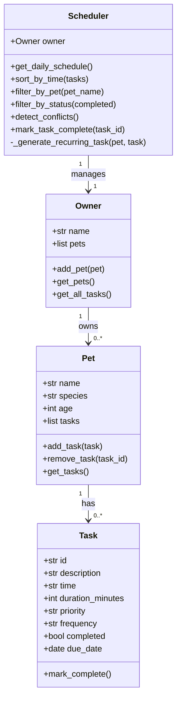

# PawPal+ Project Reflection

## 1. System Design

**Three core user actions:**
1. Add a pet (owner registers a named pet with species/age).
2. Schedule a task (attach a timed, prioritised care activity to a pet).
3. View today's schedule (see all tasks sorted chronologically with conflict warnings).

**a. Initial design**

I designed four classes:

| Class | Responsibility |
|---|---|
| `Task` | Holds a single care activity: description, scheduled time, duration, priority, frequency, completion status, and due date. |
| `Pet` | Stores pet metadata (name, species, age) and owns a list of `Task` objects. |
| `Owner` | Aggregates multiple `Pet` instances; provides a flat view of all tasks across all pets. |
| `Scheduler` | The "brain" — retrieves all tasks from the `Owner`, sorts/filters them, detects time conflicts, and handles recurring task regeneration. |

`Task` and `Pet` are Python dataclasses for clean, boilerplate-free attribute management.
`Owner` and `Scheduler` are plain classes because they contain richer behavioural logic.

UML (Mermaid.js):

**b. Design changes**

One key refinement emerged during implementation: `get_all_tasks()` on `Owner` returns `(pet_name, Task)` tuples rather than flat `Task` objects. An early AI suggestion stored `pet` as a back-reference attribute directly on `Task`, but that tightly coupled `Task` to `Pet` and made isolated unit testing harder. The tuple approach keeps `Task` a pure data object while still giving the `Scheduler` the context it needs (which pet owns each task) without coupling.

---

## 2. Scheduling Logic and Tradeoffs

**a. Constraints and priorities**

The scheduler considers:
- **Time** — tasks are sorted by their `HH:MM` scheduled time (primary sort key).
- **Priority** — surfaced via the `priority` field ("low", "medium", "high") and used for display emphasis (colour-coded badges in the UI).
- **Frequency** — "daily" and "weekly" tasks auto-regenerate their next occurrence when marked complete; "once" tasks do not.

Time was chosen as the primary sort key because a daily pet-care routine is fundamentally time-ordered. Priority is secondary context that informs urgency, not scheduling order — a low-priority dental chew still happens at 20:00 regardless of its priority label.

**b. Tradeoffs**

The conflict detector checks for *exact time matches* only — two tasks both at "09:00" are flagged, but a 60-minute walk starting at "09:00" vs. a task at "09:45" is not. This keeps the algorithm O(n) (single-pass dictionary) instead of O(n²) interval comparisons. For a personal pet-care app where most tasks are short and owners naturally leave gaps between them, this is a reasonable simplification. Duration-aware overlap detection would be a next iteration improvement.

---

## 3. AI Collaboration

**a. How you used AI**

AI was used across four distinct areas:

1. **Design brainstorming** — generating the Mermaid.js UML and checking whether class responsibilities were balanced.
2. **Scaffolding** — producing the dataclass skeletons and method stubs from the UML description in minutes rather than hours.
3. **Algorithm suggestions** — `sorted()` with a `lambda` key for time strings, `timedelta` for recurring task dates, and a dict-based O(n) conflict detector.
4. **Test generation** — drafting the initial test structure grouped by class, then refining edge cases manually.

The most effective prompts were specific and file-anchored: *"Based on this class skeleton, how should `Scheduler` retrieve all tasks from `Owner` without giving `Task` a back-reference to `Pet`?"* Vague prompts like "help me write the scheduler" produced bloated suggestions; precise, scoped prompts produced usable code.

Using a "CLI-first" workflow — verifying `pawpal_system.py` with `main.py` before touching `app.py` — also meant AI suggestions could be tested immediately in the terminal without Streamlit noise.

**b. Judgment and verification**

An early AI suggestion stored `pet` as a direct attribute on every `Task` object (a bidirectional back-reference). I rejected this because it creates tight coupling: `Task` would need to import or reference `Pet`, making `Task` harder to test in isolation and violating the principle that data classes should stay dumb. Instead I kept `Task` as a pure data object and put the `(pet_name, Task)` tuple responsibility on `Owner.get_all_tasks()`. I verified this was correct by writing a test that constructs a `Task` without any `Pet` and confirms all its methods still work independently.

---

## 4. Testing and Verification

**a. What you tested**

22 tests in `tests/test_pawpal.py` covering:

- **Task completion** — `mark_complete()` flips `completed` to `True` and is idempotent.
- **Task addition / removal** — `add_task()` increases count; `remove_task()` finds by ID and returns `False` for unknown IDs.
- **Owner aggregation** — `get_all_tasks()` returns correctly typed tuples and the right total count; empty owner returns empty list.
- **Sorting correctness** — tasks added out of order come back in chronological order; empty schedule returns empty list.
- **Filter by pet** — returns only that pet's tasks, case-insensitive; unknown pet returns empty list.
- **Filter by status** — separates pending from completed correctly.
- **Conflict detection** — flags exact time matches; passes cleanly when times differ.
- **Daily recurrence** — marking a daily task complete adds a new task due `today + 1 day`.
- **Weekly recurrence** — marking a weekly task complete adds a new task due `today + 7 days`.
- **No recurrence for "once"** — one-off tasks do not spawn a successor.
- **Unknown task ID** — `mark_task_complete("bad-id")` returns `False`.

These tests cover the three "smart" behaviours of the system (sorting, recurrence, conflict detection) plus all CRUD operations.

**b. Confidence**

**★★★★☆ (4/5).** All core happy-path scenarios and key edge cases are covered. Edge cases I would test next with more time:

- A pet with zero tasks (empty schedule for that pet specifically).
- A weekly task rolling over across a month boundary.
- Tasks at midnight ("00:00") sorting before "09:00".
- Duplicate pet names in the same owner.

---

## 5. Reflection

**a. What went well**

The strict separation between the logic layer (`pawpal_system.py`) and the UI (`app.py`) paid off immediately. I could run `python main.py` and see sorting, conflict detection, and recurrence working in the terminal before writing a single line of Streamlit code. Bugs were caught in plain Python where stack traces are clear, not buried inside widget callbacks. This "CLI-first" workflow is the single most valuable structural decision in the project.

**b. What you would improve**

Two things in a next iteration:

1. **Persistence** — `st.session_state` evaporates when the browser tab closes. A lightweight JSON or SQLite save/load layer would make the app genuinely useful day-to-day.
2. **Duration-aware conflict detection** — the current exact-match approach misses overlapping tasks with different start times. Interval overlap detection (comparing `start` and `start + duration` for each task pair) would be more accurate.

**c. Key takeaway**

Being the "lead architect" with AI means treating AI output as a fast first draft, not a final answer. The AI's back-reference suggestion was technically functional but architecturally messy — catching that required understanding *why* loose coupling matters (testability, reusability), not just whether the code ran. AI dramatically accelerates the implementation phase; human judgement still governs design quality. The right mental model is: AI is a very fast junior developer who writes code quickly but needs an architect to review the structure.
